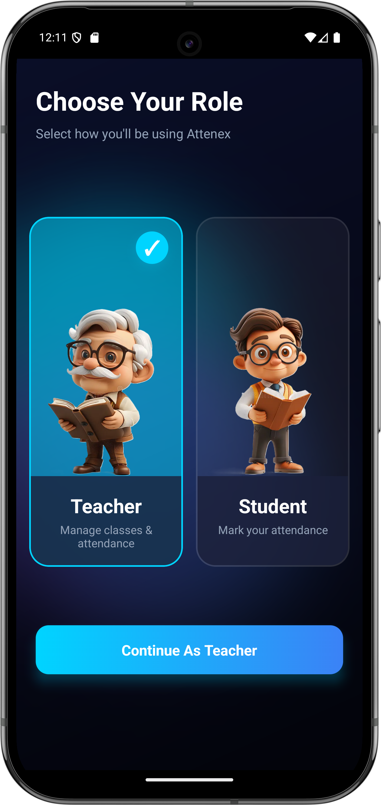
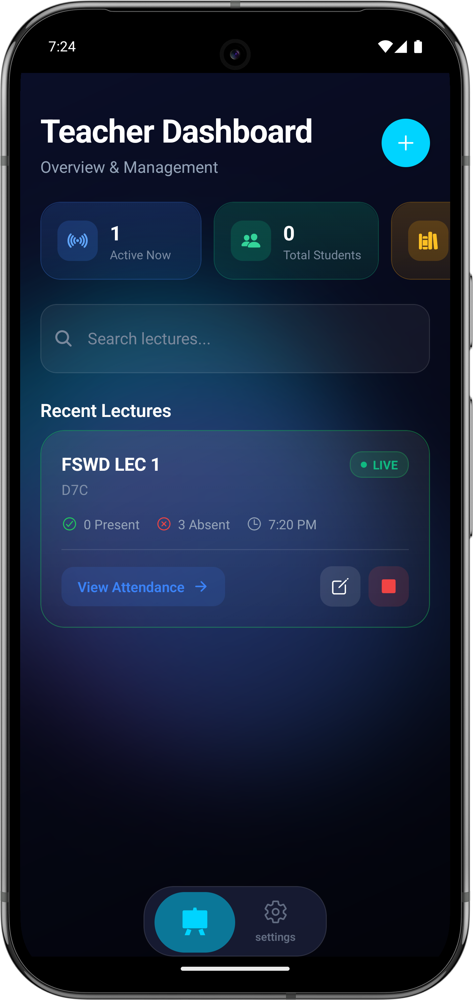
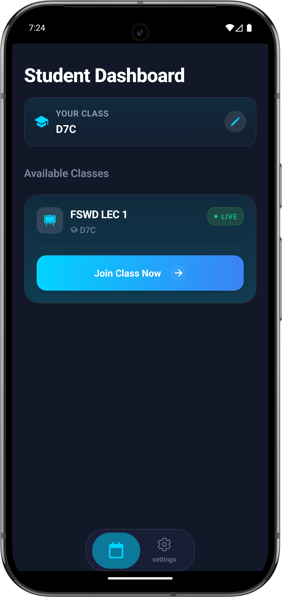

<div align="center">
	
</div>

# Attenex

**Real-time Attendance Management and Class Platform**

[](https://attenex.vercel.app)
[](https://reactnative.dev)
[](https://expo.dev)

---

Attenex is a React Native mobile application built on the Expo New Architecture. It handles role-based attendance tracking, leveraging WebSockets and location intelligence for real-time classroom syncing.

## ✨ Features

| Feature | Description |
|---|---|
| 👥 **Role-Based Client** | Distinct 
sub-trees and UI flows based on user role (Teacher vs. Student) |
| 🧠 **State Management** | Local global state via Zustand; server state, offline 
ence, and re-fetching via TanStack Query |
| ⚡ **Performance Optimizations** | `react-native-nitro-modules` (NitroImage), Reanimated + Unistyles, and Shopify RN performance profiling |
| 🔐 **Authentication** | Token-based auth with Email, Google, and LinkedIn OAuth |
| 📡 **Real-time Sync** | WebSocket-based classroom updates and live attendance flow |

---

## 📸 Product Preview

<div align="center">
	
	&nbsp;&nbsp;
	
	&nbsp;&nbsp;
	
</div>

---

## 🛠️ Technology Stack

### Mobile Client
* **Framework**: React Native 0.81 + Expo Router
* **Language**: TypeScript
* **State / Data**: Zustand, TanStack Query
* **Styling & Animation**: React Native Unistyles, React Native Reanimated, `@shopify/react-native-skia`

### Backend (via `/backend`)
* **Environment**: Node.js & Express
* **Database / ORM**: Postgres + Drizzle ORM
* **Real-time**: Socket.IO
* **Services**: Firebase Cloud Messaging

---

## 🚀 Local Development Setup

### Requirements
* Node.js & [Bun](https://bun.sh/)
* Android Studio Emulator or iOS Simulator

### Build Instructions

```bash
git clone https://github.com/your-username/attenex.git
cd attenex
bun install
```

```bash
bun run android
# or
bun run ios
```

> This project uses custom native modules (including Nitro), so use a development client build instead of Expo Go.
